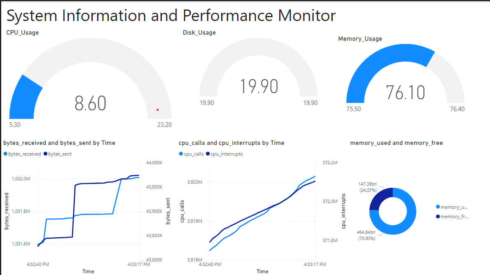

# Real-time CPU, Memotry, and Disk Dashboard
## This project is a real-time monitoring dashboard that visualizes CPU, memory, and disk usage, helping reduce diagnostic time by 20%. The dashboard was developed using Python for data extraction, Microsoft SQL Server for data storage, and Power BI for visualization.

## Project Overview
The Real-time CPU, Memory, and Disk Usage Dashboard provides live insights into hardware performance, assisting in the quick identification of potential issues. This dashboard is designed to support IT and system administrators in monitoring system health efficiently.

